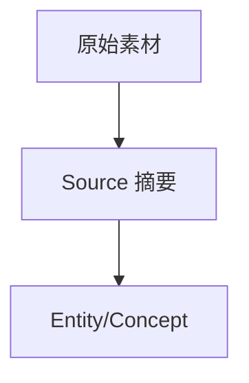

# Wiki Schema — 知识库结构定义（vault 版）

本文档定义 LLM Wiki 的三层目录架构、页面类型规范和元数据约定。存储后端为本地 Obsidian vault（纯 Markdown 文件），不再依赖飞书。

## 根目录约定

每个 wiki 是一个独立根目录 `<wiki-name>/`，**嵌套在 vault 现有目录内**（遵守「禁止新建 vault 一级目录」铁律）：

- 默认落点：`$VAULT/24_阅读思考/<wiki-name>/`
- 亦可嵌套到其他现有目录（如 `21_ai/<wiki-name>/`），由用户在 init 时指定父目录
- 读取 `$VAULT` 环境变量；未设按 `platform.system()` 回退（mac → `~/Documents/steven_vault`，Linux/VM → `/home/ubuntu/webdav/steven_vault`）

## 三层架构

```
<wiki-name>/                           # 根文件夹（init 时用户自定义名称，默认 my-wiki）
├── AGENTS.md                          # Schema 层
├── raw/                               # 原始素材层（不可变，LLM 只读不写）
│   ├── <子目录1>/                     # 用户在 init 时自定义
│   ├── <子目录2>/                     # 默认: papers, articles, repos,
│   └── ...                            #        datasets, images, assets
└── wiki/                              # Wiki 层
    ├── INDEX.md                       # 页面注册表
    ├── LOG.md                         # 操作日志
    ├── sources/                       # 源文档摘要
    ├── entities/                      # 实体页
    ├── concepts/                      # 概念页
    ├── comparisons/                   # 对比分析
    └── overviews/                     # 综述
```

> **raw/ 子目录**：init 时展示默认列表 `[papers, articles, repos, datasets, images, assets]`，用户可增删改。最终列表记录在 INDEX.md「Wiki 配置」的 `raw_subdirs` 与本地配置中。

### Schema 层 — `AGENTS.md`

Wiki 的结构约定和 LLM 行为规范文档。定义：
- 页面类型和命名规范
- 元数据 frontmatter 格式
- 交叉引用约定（用 `[[wikilink]]`）
- ingest/query/lint 工作流规则
- 用户偏好和领域特定约定

由用户和 LLM 共同维护，随着 Wiki 演进逐步完善。

### Raw 层 — `raw/`

原始素材，**不可变，LLM 只读不写**。按素材类型分子目录存放。子目录在 init 时由用户自定义，默认提供以下 6 个：

| 子目录 | 用途 | 存放方式 |
|-------|------|---------|
| `papers/` | 学术论文 | PDF 或转换后的 MD |
| `articles/` | 博客文章、新闻报道 | Markdown 上传 |
| `repos/` | 代码仓库 README / 关键文件快照 | MD 文件 |
| `datasets/` | 数据文件 | CSV、JSON 等 |
| `images/` | 图表、架构图、截图 | PNG/JPG 等 |
| `assets/` | 各类附件 | 直接存放 |

> 以上仅为默认值。用户可在 init 时增删改子目录列表。实际子目录列表以 INDEX.md「Wiki 配置」为准。

**写入方式**: raw/ 由用户负责写入（复制本地文件 / 抓取的网页 MD），LLM 只读不写。用户将原始素材放入对应子目录后通知 LLM 进行摄入处理。

#### Raw 装配模式（init 时确定，记录在 INDEX.md「Wiki 配置」的 `raw_mode`）

| 模式 | 含义 | INDEX 目录配置 | 下游枚举方式 |
|------|------|---------------|-------------|
| `create`（默认） | 本 wiki 新建 `raw/` 及子目录 | `raw` + 各 `raw/<子目录>` 静态行 | 直接 `ls` 对应子目录 |
| `reference` | 引用一棵已有 vault 目录树（如现有笔记目录）为 raw 层 | 仅 `raw` 一行，指向**原目录真实路径**，无 `raw/<子目录>` 行 | 用 `scripts/list_raw_tree.sh` 实时递归枚举原树，感知后续新增 |
| `none` | 不创建 raw 层 | `raw` 行为 `-` | — |

> **reference 模式**：raw 登记的是原目录的真实路径，原树原地不动、由其维护者增删；本 wiki 在每次 ingest 时实时枚举原树，无需把素材搬进来。

### Wiki 层 — `wiki/`

LLM 生成和维护的所有知识页面。LLM 完全拥有此层。

- `INDEX.md` — 页面注册表，所有操作的入口
- `LOG.md` — append-only 操作日志
- `sources/` — Source 摘要页（LLM 对 raw/ 素材的分析产物）
- `entities/` — Entity 实体页
- `concepts/` — Concept 概念页
- `comparisons/` — Comparison 对比分析页
- `overviews/` — Overview 综述页

## 页面类型

所有 Wiki 页面（INDEX.md 和 LOG.md 除外）的**第一个块**必须是 YAML frontmatter：

```yaml
---
type: source | entity | concept | comparison | overview
created: YYYY-MM-DD HH:mm
updated: YYYY-MM-DD HH:mm
source: "[[raw/articles/xxx.md]]"   # 原始来源 wikilink（Source 页必填）
related: ["[[entities/foo.md]]"]    # 关联页面 wikilink 列表
aliases: [别名1, 别名2]
tags: [标签1, 标签2]
---
```

> 飞书版用 `<callout>` HTML 块，vault 版统一用 YAML frontmatter（Obsidian 原生支持，可被 dataview/query 检索）。

### Source（源文档摘要）

**标题格式**: `Source: <原始标题>`
**存放目录**: `wiki/sources/`

**必须段落**:
- YAML frontmatter
- `## 摘要`（等价：`## 概要`）— 核心观点 3-5 句话
- `## 关键要点`（等价：`## 核心要点`、`## 要点`）— 要点列表
- `## 提取的实体`（等价：`## 实体`、`## 涉及的实体`）— 用 `[[wikilink]]` 链接
- `## 提取的概念`（等价：`## 概念`、`## 涉及的概念`）— 用 `[[wikilink]]` 链接
- `## 原始来源`（等价：`## 原始素材`）— 用 `[[wikilink]]` 指向 raw/ 下的素材文件

### Entity（实体页）

**标题格式**: `Entity: <实体名称>`
**存放目录**: `wiki/entities/`
**识别标准**: 命名实体（人物/组织/产品/工具/系统），在源文档中被实质性讨论且可提取 ≥3 条关键事实。

**必须段落**:
- YAML frontmatter
- `## 概述`
- `## 关键事实`
- `## 出现在`（等价：`## 出处`、`## 相关来源`、`## 来源`）— 引用源文档 wikilink
- `## 相关实体`（等价：`## 关联实体`）

### Concept（概念页）

**标题格式**: `Concept: <概念名称>`
**存放目录**: `wiki/concepts/`
**识别标准**: 抽象概念（理论/方法论/模式/原则/框架），在源文档中有定义或解释，且具有跨源复用价值。

**必须段落**:
- YAML frontmatter
- `## 定义`
- `## 详细说明`（等价：`## 描述`、`## 详述`）
- `## 来源`（等价：`## 相关来源`）
- `## 相关概念`（等价：`## 关联概念`）

### Comparison（对比分析）

**标题格式**: `Comparison: <主题>` 或 `Comparison: <A> vs <B>`
**存放目录**: `wiki/comparisons/`

**必须段落**:
- YAML frontmatter
- `## 对比维度`（等价：`## 维度`）
- `## 分析`（推荐表格）
- `## 结论`（等价：`## 总结`）
- `## 参考来源`（等价：`## 参考`、`## 相关来源`、`## 来源`）

### Overview（综述）

**标题格式**: `Overview: <范围>`
**存放目录**: `wiki/overviews/`

**必须段落**:
- YAML frontmatter
- `## 概览`（等价：`## 概述`、`## 引言`）
- `## 核心主题`（等价：`## 主题`）
- `## 当前认知`（等价：`## 当前理解`）
- `## 开放问题`（等价：`## 未决问题`）
- `## 参考`（等价：`## 参考来源`、`## 相关来源`）

## INDEX.md 文档格式

`wiki/INDEX.md` 是整个 Wiki 的核心注册表和导航入口。

```markdown
## 目录配置

| 目录 | Path |
|------|------|
| root (<wiki-name>) | 24_阅读思考/<wiki-name> |
| raw | 24_阅读思考/<wiki-name>/raw |
| raw/<子目录1> | 24_阅读思考/<wiki-name>/raw/<子目录1> |
| wiki | 24_阅读思考/<wiki-name>/wiki |
| wiki/sources | 24_阅读思考/<wiki-name>/wiki/sources |
| wiki/entities | 24_阅读思考/<wiki-name>/wiki/entities |
| wiki/concepts | 24_阅读思考/<wiki-name>/wiki/concepts |
| wiki/comparisons | 24_阅读思考/<wiki-name>/wiki/comparisons |
| wiki/overviews | 24_阅读思考/<wiki-name>/wiki/overviews |

> Path 列为 vault 内相对路径（相对 $VAULT）。reference 模式：只有 `raw` 一行指向被引用原目录真实路径。
```

```markdown
## Wiki 配置

| 键 | 值 |
|---|---|
| wiki_name | <用户自定义名称> |
| storage_type | vault |
| parent_dir | <wiki 根目录所在的现有 vault 目录，如 24_阅读思考> |
| raw_mode | create / reference / none |
| raw_source_path | <reference 模式：原目录真实路径；否则 -> |
| 创建时间 | YYYY-MM-DD HH:mm |
| 最后更新 | YYYY-MM-DD HH:mm |
| 页面总数 | N |

## 页面注册表

| 标题 | 类型 | 路径 | 目录 | 最后更新 | 关联 | 别名 | 标签 | Raw | 出链 | 入链 | 证据数 | 摘要 |
|------|------|------|------|---------|------|------|------|-----|------|------|--------|------|
```

- **路径**: 页面在 vault 内的相对路径（如 `24_阅读思考/<wiki-name>/wiki/sources/xxx.md`），用于 `[[wikilink]]` 引用
- **别名**: 中英文名、缩写、常见别称，使用 `;` 分隔，用于 query 粗召回和去重
- **标签**: 主题、领域、技术栈或来源类别，使用 `;` 分隔
- **Raw**: Source 页对应 raw 文件的相对路径；非 Source 页面为空
- **出链/入链**: 当前页引用/被引用的 wiki 页面路径列表，使用 `;` 分隔
- **证据数**: 页面内直接引用 Source 或原始证据的数量
- **摘要**: 一句话摘要，供 query 在不读正文时做初筛

### 索引操作规则

- **读取**: 直接 `Read` `wiki/INDEX.md`，解析目录配置（路径映射）和页面注册表
- **更新注册表（首选：整篇重写）**: INDEX.md 完全由 LLM 拥有，每次操作开始已读全。合并新增/变更后整体重写文件
- **小改动备选**: 仅改个别字段（如「页面总数」「最后更新」）时，精确替换那一行
- 不要 append 新表行——append 出的表格行不会并入原表

## LOG.md 文档格式

`wiki/LOG.md` 是 append-only 操作日志。每个条目以 `---` 分隔，时间戳使用 ISO 8601，详见 [templates/pages.md](templates/pages.md) 的「日志条目模板」章节。

## 交叉引用规则

1. 使用 Obsidian `[[wikilink]]` 链接其他 wiki 页面（可带 `#标题` 锚点）
2. 链接 raw 素材文件使用 `[[raw/.../file.md]]` 相对路径
3. 外部链接保留原始 URL（不受此限制）
4. **双向链接** — 创建 A 引用 B 时，也应更新 B 引用 A
5. 从 INDEX.md 页面注册表查找目标页面路径

> 飞书版用 `<cite type="doc" doc-id="..."></cite>`，vault 版统一用 `[[wikilink]]`，无需 doc_id。

## 图表规范

飞书版用「画板 DSL」，vault 版统一用 **Mermaid** 代码块：

````markdown

````
